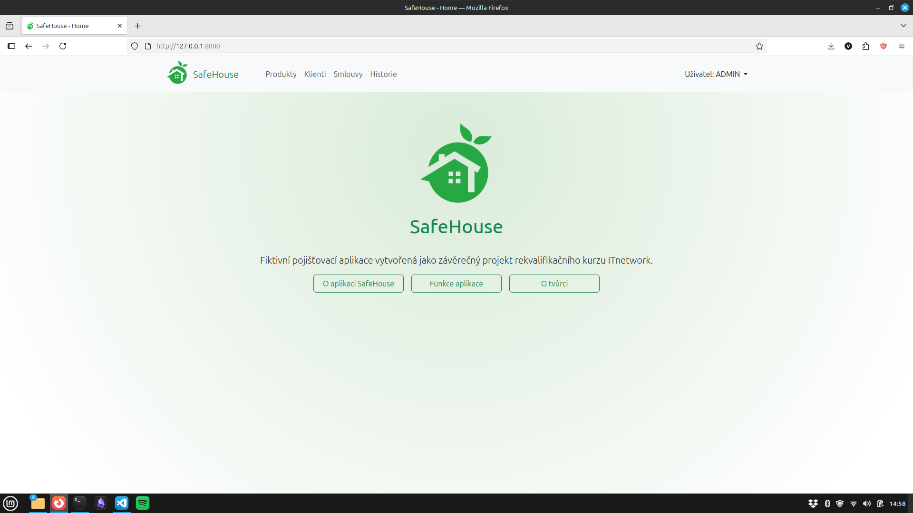
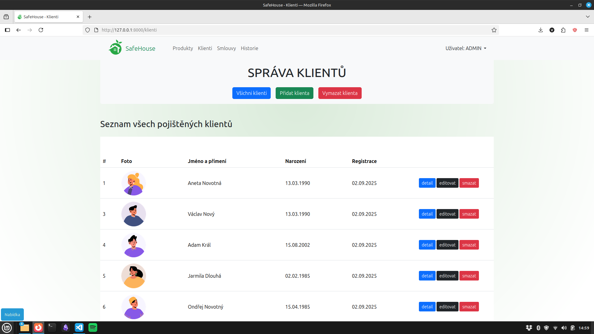
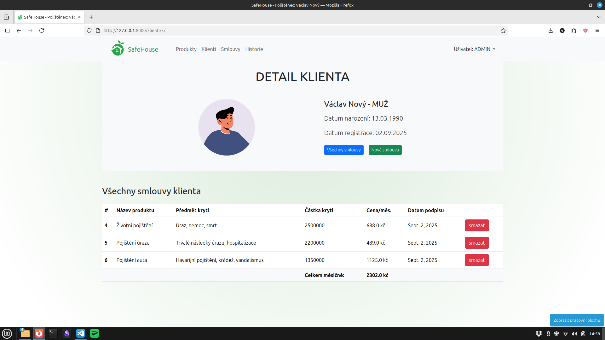

# 🏠 SafeHouse

**SafeHouse** je fiktivní pojišťovací aplikace vytvořená v Django a slouží jako ukázkový projekt.

🎥 **[Video ukázka](https://youtu.be/OWsMLuW-vfE)**
<div style="display:flex; justify-content:space_around;">
  
  
  
</div>
---

## 🚀 Jak projekt spustit

### 1. Klonování repozitáře
```bash
git clone https://github.com/VaclavNekolny/SafeHouse.git
cd SafeHouse
```

### 2. Instalace
``` bash
python3 -m venv venv
source venv/bin/activate   # Linux / macOS
venv\Scripts\activate      # Windows
pip install -r requirements.txt
```
### 3. Spuštění
``` bash
python manage.py runserver
```
- otevřít v prohlížeči: http://127.0.0.1:8000/

---

## ✨ Funkcionality

- Sekce **Produkty**
  - CRUD správa pojišťovacích produktů     
- Sekce **Klienti**
  - CRUD správa klientů
  - Zobrazení **detailů klientů** a jejich podepsaných smluv  
- Sekce **Smlouvy**:  
  - přehled všech podepsaných smluv  
  - zobrazení celkového **měsíčního inkasa pojišťovny**  
- Sekce **Historie**:  
  - záznam všech událostí v aplikaci  
  - vytvoření/úpravy/smazání klientů a smluv  
  - přiřazení smlouvy ke klientovi  

---

